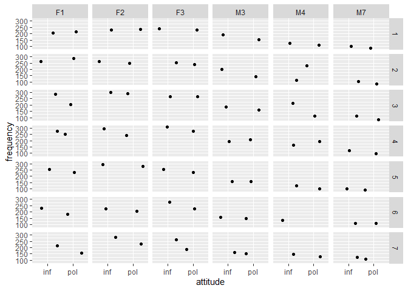

``` r
library(lme4)
```

    ## Warning: package 'lme4' was built under R version 4.1.2

    ## Loading required package: Matrix

    ## Warning: package 'Matrix' was built under R version 4.1.2

``` r
politeness<- 
  read.csv("http://www.bodowinter.com/tutorial/politeness_data.csv")

which(is.na(politeness)==T)
```

    ## [1] 375

``` r
politeness <- politeness[complete.cases(politeness),]
```

``` r
boxplot(frequency ~ attitude*gender,
        col=c("white","lightgray"),politeness)
```

<!-- -->

# What are you actually trying to see

``` r
library(ggplot2)
```

    ## Warning: package 'ggplot2' was built under R version 4.1.2

``` r
library(dplyr)
```

    ## 
    ## Attaching package: 'dplyr'

    ## The following objects are masked from 'package:stats':
    ## 
    ##     filter, lag

    ## The following objects are masked from 'package:base':
    ## 
    ##     intersect, setdiff, setequal, union

``` r
politeness %>% ggplot(aes(x= attitude, y=frequency)) +
                geom_boxplot() 
```

<!-- -->

``` r
politeness %>% ggplot(aes(x= attitude, y=frequency)) +
                geom_boxplot() +
                facet_grid(.~subject)
```

<!-- -->

``` r
politeness %>% ggplot(aes(x= attitude, y=frequency)) +
                geom_boxplot() +
                facet_grid(.~scenario)
```

<!-- -->

``` r
politeness %>% ggplot(aes(x= attitude, y=frequency)) +
                geom_jitter() +
                facet_grid(scenario~subject)
```

<!-- -->

Syntax model = lmer(target \~ fixed1 + fixed2+ (1\|random1) +
(1\|random2), data=data)

# An Example of Linear Mixed Model

``` r
politeness.model = lmer(frequency ~ attitude +
                                    (1|subject) + 
                                    (1|scenario) , 
                                    data=politeness)
politeness.model
```

    ## Linear mixed model fit by REML ['lmerMod']
    ## Formula: frequency ~ attitude + (1 | subject) + (1 | scenario)
    ##    Data: politeness
    ## REML criterion at convergence: 793.4536
    ## Random effects:
    ##  Groups   Name        Std.Dev.
    ##  scenario (Intercept) 14.80   
    ##  subject  (Intercept) 63.36   
    ##  Residual             25.42   
    ## Number of obs: 83, groups:  scenario, 7; subject, 6
    ## Fixed Effects:
    ## (Intercept)  attitudepol  
    ##      202.59       -19.69

``` r
politeness.model = lmer(frequency ~ attitude + gender +
                          (1 | subject) +
                          (1 | scenario),
                        data = politeness)

politeness.model
```

    ## Linear mixed model fit by REML ['lmerMod']
    ## Formula: frequency ~ attitude + gender + (1 | subject) + (1 | scenario)
    ##    Data: politeness
    ## REML criterion at convergence: 775.4547
    ## Random effects:
    ##  Groups   Name        Std.Dev.
    ##  scenario (Intercept) 14.81   
    ##  subject  (Intercept) 24.81   
    ##  Residual             25.41   
    ## Number of obs: 83, groups:  scenario, 7; subject, 6
    ## Fixed Effects:
    ## (Intercept)  attitudepol      genderM  
    ##      256.85       -19.72      -108.52

``` r
politeness.null = lmer(frequency ~ gender +
                         (1 | subject) + (1 | scenario),
                       data = politeness,
                       REML = FALSE)

politeness.null
```

    ## Linear mixed model fit by maximum likelihood  ['lmerMod']
    ## Formula: frequency ~ gender + (1 | subject) + (1 | scenario)
    ##    Data: politeness
    ##       AIC       BIC    logLik  deviance  df.resid 
    ##  816.7193  828.8135 -403.3597  806.7193        78 
    ## Random effects:
    ##  Groups   Name        Std.Dev.
    ##  scenario (Intercept) 13.83   
    ##  subject  (Intercept) 20.24   
    ##  Residual             27.42   
    ## Number of obs: 83, groups:  scenario, 7; subject, 6
    ## Fixed Effects:
    ## (Intercept)      genderM  
    ##       247.0       -108.2

``` r
politeness.model = lmer(frequency ~ attitude + gender +
                          (1 | subject) + (1 | scenario),
                        data = politeness,
                        REML = FALSE)
```

``` r
anova(politeness.null,politeness.model)
```

    ## Data: politeness
    ## Models:
    ## politeness.null: frequency ~ gender + (1 | subject) + (1 | scenario)
    ## politeness.model: frequency ~ attitude + gender + (1 | subject) + (1 | scenario)
    ##                  npar    AIC    BIC  logLik deviance  Chisq Df Pr(>Chisq)    
    ## politeness.null     5 816.72 828.81 -403.36   806.72                         
    ## politeness.model    6 807.10 821.61 -397.55   795.10 11.618  1  0.0006532 ***
    ## ---
    ## Signif. codes:  0 '***' 0.001 '**' 0.01 '*' 0.05 '.' 0.1 ' ' 1

# Random slopes versus random intercepts

``` r
coef(politeness.model)
```

    ## $scenario
    ##   (Intercept) attitudepol   genderM
    ## 1    243.4860   -19.72207 -108.5173
    ## 2    263.3592   -19.72207 -108.5173
    ## 3    268.1322   -19.72207 -108.5173
    ## 4    277.2546   -19.72207 -108.5173
    ## 5    254.9319   -19.72207 -108.5173
    ## 6    244.8015   -19.72207 -108.5173
    ## 7    245.9618   -19.72207 -108.5173
    ## 
    ## $subject
    ##    (Intercept) attitudepol   genderM
    ## F1    243.3684   -19.72207 -108.5173
    ## F2    266.9442   -19.72207 -108.5173
    ## F3    260.2276   -19.72207 -108.5173
    ## M3    284.3535   -19.72207 -108.5173
    ## M4    262.0575   -19.72207 -108.5173
    ## M7    224.1293   -19.72207 -108.5173
    ## 
    ## attr(,"class")
    ## [1] "coef.mer"

``` r
politeness.model = lmer( frequency ~ attitude + gender + 
                            (1 + attitude | subject) +
                            (1 + attitude | scenario),
                            data = politeness,
                            REML = FALSE)
```

    ## boundary (singular) fit: see ?isSingular

``` r
coef(politeness.model)
```

    ## $scenario
    ##   (Intercept) attitudepol   genderM
    ## 1    245.2630   -20.43990 -110.8062
    ## 2    263.3044   -15.94550 -110.8062
    ## 3    269.1439   -20.63124 -110.8062
    ## 4    276.8329   -16.30057 -110.8062
    ## 5    256.0602   -19.40628 -110.8062
    ## 6    246.8625   -21.94848 -110.8062
    ## 7    248.4714   -23.55653 -110.8062
    ## 
    ## $subject
    ##    (Intercept) attitudepol   genderM
    ## F1    243.8065   -20.68446 -110.8062
    ## F2    266.7314   -19.16924 -110.8062
    ## F3    260.1482   -19.60436 -110.8062
    ## M3    285.6972   -17.91570 -110.8062
    ## M4    264.2019   -19.33643 -110.8062
    ## M7    227.3618   -21.77138 -110.8062
    ## 
    ## attr(,"class")
    ## [1] "coef.mer"

``` r
politeness.model = lmer( frequency ~ attitude + gender + 
                            (1 + attitude | subject) +
                            (1 + attitude | scenario),
                            data = politeness,
                            REML = FALSE)
```

    ## boundary (singular) fit: see ?isSingular

``` r
politeness.null = lmer( frequency ~ gender + 
                            (1 + attitude | subject) +
                            (1 + attitude | scenario),
                            data = politeness,
                            REML = FALSE)
```

    ## boundary (singular) fit: see ?isSingular

``` r
anova(politeness.null,politeness.model)
```

    ## Data: politeness
    ## Models:
    ## politeness.null: frequency ~ gender + (1 + attitude | subject) + (1 + attitude | scenario)
    ## politeness.model: frequency ~ attitude + gender + (1 + attitude | subject) + (1 + attitude | scenario)
    ##                  npar    AIC    BIC  logLik deviance  Chisq Df Pr(>Chisq)   
    ## politeness.null     9 819.61 841.37 -400.80   801.61                        
    ## politeness.model   10 814.90 839.09 -397.45   794.90 6.7082  1   0.009597 **
    ## ---
    ## Signif. codes:  0 '***' 0.001 '**' 0.01 '*' 0.05 '.' 0.1 ' ' 1
